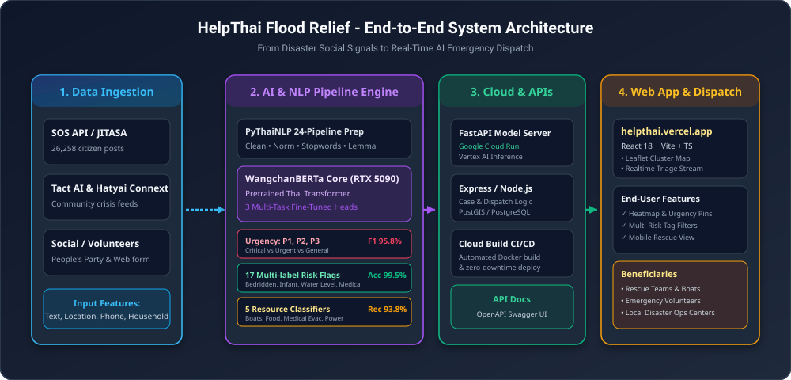
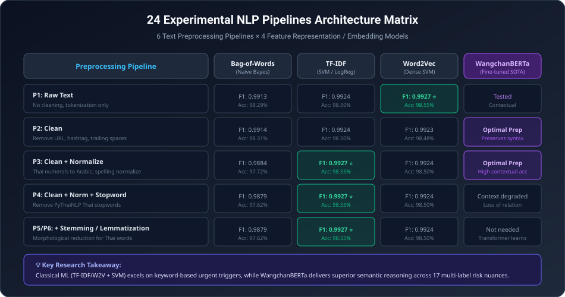
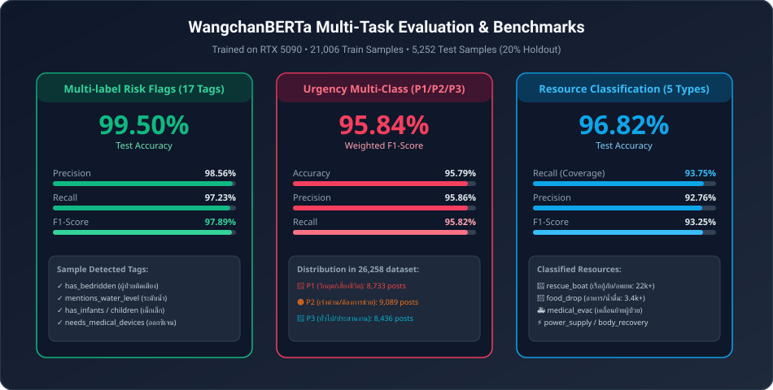

<div align="center">

# 🌊 HelpThai Flood Relief AI & Crisis Management System
### ระบบคัดกรองและวิเคราะห์ข้อความขอความช่วยเหลือผู้ประสบภัยน้ำท่วมด้วย AI & NLP

[](https://www.python.org/)
[](https://fastapi.tiangolo.com/)
[](https://pytorch.org/)
[](https://huggingface.co/airesearch/wangchanberta-base-att-spm-uncased)
[](https://reactjs.org/)
[](https://cloud.google.com/)
[](https://helpthai.vercel.app/)
[](LICENSE)

<br/>

<p align="center">
  

</p>

<p align="center">
  <b>ระบบประมวลผลภาษาธรรมชาติ (NLP) และแพลตฟอร์มศูนย์รับแจ้งเหตุฉุกเฉินน้ำท่วมแบบเรียลไทม์</b><br/>
  คัดกรองระดับความวิกฤต (P1/P2/P3), ตรวจจับความเสี่ยงเฉพาะ 17 มิติ (ผู้ป่วยติดเตียง, เด็กเล็ก, ระดับน้ำสูง), จำแนกทรัพยากรที่ต้องการ (เรือกู้ภัย, อาหาร/น้ำ, เคลื่อนย้ายผู้ป่วย) จากข้อมูลประชาชนกว่า 26,258 โพสต์
</p>

---

### 🌐 Live Production Links

| Service | Link | Description |
| :--- | :--- | :--- |
| **🚀 Web Application** | [**helpthai.vercel.app**](https://helpthai.vercel.app/) | แดชบอร์ดแผนที่ศูนย์สั่งการและรับแจ้งเหตุแบบ Interactive Live Map |
| **⚡ AI Model API** | [**flood-api-sduwialsmq-as.a.run.app/docs**](https://flood-api-sduwialsmq-as.a.run.app/docs#/) | FastAPI Swagger UI รันโมเดล WangchanBERTa บน Google Cloud Run |

---

</div>

## 📌 บทคัดย่อและวัตถุประสงค์ของโครงการ (Overview & Objectives)

ในช่วงเหตุการณ์อุทกภัยในประเทศไทย ข้อมูลขอความช่วยเหลือจากประชาชนบนช่องทางโซเชียลมีเดียและแพลตฟอร์มเปิดมีปริมาณมหาศาล (Big Data Stream) และมีความกระจัดกระจาย ทำให้ทีมกู้ภัยและจิตอาสาไม่สามารถคัดกรองเคสที่มีความเสี่ยงถึงชีวิตได้ทันท่วงที

โครงงานนี้จึงถูกพัฒนาขึ้นเพื่อ:
1. **คัดกรองและจัดลำดับความสำคัญเร่งด่วน (Urgency Triage):** แยกแยะเคสวิกฤตเสี่ยงชีวิต (P1), เร่งด่วน (P2), และทั่วไป (P3)
2. **สกัดความต้องการทรัพยากรและตรวจจับกลุ่มเปราะบาง (Resource & Risk Tagging):** ระบุเคสที่มีผู้ป่วยติดเตียง, คนพิการ, ทารก, ต้องการออกซิเจน/เครื่องมือแพทย์ หรือต้องการเรือกู้ภัย
3. **สกัดข้อมูลสำคัญ (Information Extraction):** ดึงเบอร์โทรศัพท์, พิกัด GPS, ที่อยู่สถานที่โดยอัตโนมัติ
4. **แสดงผลบนศูนย์สั่งการกู้ภัยเรียลไทม์ (Live Dispatch Map):** เชื่อมโยงผลวิเคราะห์ AI เข้าสู่ Interactive Map Dashboard เพื่อให้ทีมหน้างานเข้าช่วยเหลือได้อย่างแม่นยำและรวดเร็วที่สุด

---

## 🖥️ ภาพรวมระบบและหน้าจอการทำงาน (Application Showcase)

<div align="center">
  
  


  <p><i>ศูนย์สั่งการกู้ภัยอัจฉริยะ (HelpThai Flood Emergency Dispatch Center) พร้อมระบบ Pin Clustering และการแท็กเคสอัตโนมัติ</i></p>
</div>

### ไฮไลต์ฟังก์ชันของระบบ
- 📍 **Interactive Map & Clustering:** แสดงตำแหน่งผู้ประสบภัยแบบกลุ่มพินความหนาแน่น แยกสีตามระดับความวิกฤต (แดง: P1, ส้ม: P2, เขียว/ฟ้า: P3)
- 🏷️ **Multi-Dimensional Tagging:** แสดงป้ายกำกับความต้องการและกลุ่มเสี่ยงทันที เช่น `ต้องการเรือกู้ภัย`, `ผู้ป่วยติดเตียง`, `เด็กเล็ก`, `ระดับน้ำสูง`
- 📋 **Live Case Management:** อัปเดตสถานะการเข้าช่วยเหลือ (Pending, Assigned, In Progress, Resolved) แบบเรียลไทม์
- 🔍 **Geospatial & Semantic Search:** ค้นหาตามชื่ออำเภอ ชุมชน เบอร์โทร หรือคีย์เวิร์ดสถานการณ์น้ำท่วม

---

## 🏗️ สถาปัตยกรรมระบบ (System Architecture)

<div align="center">
  
</div>

ระบบประกอบด้วย 4 ส่วนหลัก:
1. **Data Ingestion Layer:** รวบรวมข้อมูลคำขอช่วยเหลือ 26,258 โพสต์ จากความร่วมมือของ **Tact AI**, **Hatyai Connext**, **พรรคประชาชน - People's Party**, และระบบ **SOS API (JITASA.CARE)**
2. **NLP Engine & Model Core:** พัฒนากระบวนการเตรียมข้อมูล 6 รูปแบบ จับคู่กับโมเดล 4 ประเภท (**รวม 24 Pipelines**) พร้อมเทรนโมเดล Deep Learning **WangchanBERTa** แบบ Multi-Task บนฮาร์ดแวร์ NVIDIA RTX 5090
3. **Cloud & Microservices Layer:** ให้บริการ REST API ด้วย FastAPI บน Google Cloud Run เชื่อมต่อกับ Express.js Backend และฐานข้อมูล PostgreSQL / PostGIS
4. **Frontend Dispatcher Layer:** พัฒนาด้วย React 18, TypeScript, Vite, TailwindCSS และ Leaflet Maps โฮสต์บน Vercel Edge Network

---

## 🔬 การทดลอง 24 Pipelines และการเตรียมข้อมูล (24 NLP Pipelines)

เพื่อค้นหากระบวนการเตรียมข้อความและการแทนค่าเวกเตอร์ที่ดีที่สุด โครงการได้ออกแบบการทดลองแบบเต็มรูปแบบ **6 Preprocessing Pipelines × 4 Feature Representations**:

<div align="center">
  
</div>

### รายละเอียด 6 ขั้นตอน Preprocessing
1. **Pipeline 1 (Raw):** ข้อความดิบ ตัดคำภาษาไทยเท่านั้น
2. **Pipeline 2 (Clean):** ทำความสะอาด ตัด URL, Hashtag, เครื่องหมายวรรคตอน และช่องว่างซ้ำซ้อน
3. **Pipeline 3 (Clean + Norm):** แปลงตัวเลขอารบิก/ไทย, ปรับรูปแบบการสะกดคำ (เช่น "น้ำท่วมนิดหน่อย", "น้ำ ท่วม" -> "น้ำท่วม")
4. **Pipeline 4 (Clean + Norm + Stopword):** ลบคำหยุด (Thai Stopwords จาก PyThaiNLP เช่น "ที่", "และ", "คือ")
5. **Pipeline 5 (Clean + Norm + Stopword + Stemming):** ตัดส่วนขยายคำด้วยกฎ Rule-based / Dictionary
6. **Pipeline 6 (Clean + Norm + Stopword + Lemmatization):** แปลงรูปคำกลับสู่รูปพจนานุกรม

### 4 รูปแบบการแทนค่าข้อความ (Text Representations)
- **Bag-of-Words (BoW):** นับความถี่คำในเอกสาร + Naive Bayes Classifier
- **TF-IDF:** ถ่วงน้ำหนักความสำคัญของคำเฉพาะกลุ่ม + Linear SVM / Logistic Regression
- **Word2Vec (Skip-Gram / CBOW):** แปลงประโยคเป็นเวกเตอร์ความหมายเชิงปริภูมิ + SVM
- **Transformer (WangchanBERTa):** โมเดลภาษาไทย Pre-trained Contextual Representation ขนาด 78.48 GB Corpus

---

## 📊 ผลการประเมินประสิทธิภาพโมเดล (Model Evaluation & Benchmarks)

<div align="center">
  
</div>

### 1. ผลลัพธ์โมเดล WangchanBERTa (Deep Learning)
ประเมินบนชุดข้อมูลทดสอบ (Test Set) จำนวน **5,252 ตัวอย่าง (20% Holdout)**:

| Task / Multi-Task Head | Model | Accuracy | Precision | Recall | F1-Score |
| :--- | :--- | :---: | :---: | :---: | :---: |
| **Urgency Classification** *(P1/P2/P3)* | `WangchanBERTa-base` | **95.79%** | **95.86%** | **95.82%** | **95.84%** |
| **Multi-label Risk Flags** *(17 Tags)* | `WangchanBERTa-base` | **99.50%** | **98.56%** | **97.23%** | **97.89%** |
| **Resource Classification** *(5 Classes)* | `WangchanBERTa-base` | **96.82%** | **92.76%** | **93.75%** | **93.25%** |

#### รายละเอียด 17 Risk & Need Tags ที่โมเดลตรวจจับได้
- `has_bedridden` (ผู้ป่วยติดเตียง)
- `has_elderly` (ผู้สูงอายุ)
- `has_infants` / `has_children` (ทารกและเด็กเล็ก)
- `has_pregnant` (สตรีมีครรภ์)
- `has_disabled` (ผู้พิการ)
- `has_medical` / `needs_medical_devices` (มีอาการป่วย / ต้องการเครื่องมือแพทย์ เช่น ออกซิเจน)
- `mentions_water_level` (ระบุระดับน้ำสูง/มิดหลังคา/ชั้นสอง)
- `needs_evac` / `needs_transport` (ต้องการอพยพ / รถยกสูง)
- `has_animals` (สัตว์เลี้ยง)
- `mentions_fatality` (มีผู้เสียชีวิต)
- `needs_medication`, `needs_power`, `needs_supplies`, `needs_comms`, `has_large_group`

### 2. สรุปผลเปรียบเทียบ Classical ML (24 Pipelines)
- **โมเดล Classical ที่ดีที่สุด:** `SVM with Word2Vec` (Pipeline 1) และ `SVM with TF-IDF` (Pipeline 4) ให้ค่า F1-Score สูงถึง **0.9927**
- **ข้อค้นพบเชิงวิจัย:**
  - Classical Model (TF-IDF/SVM) ทำงานได้ดีและรวดเร็วมากสำหรับคีย์เวิร์ดตรงตัว
  - สำหรับข้อความที่มีความซับซ้อน บริบทกำกวม หรือต้องการสกัด 17 มิติความเสี่ยงพร้อมกัน **WangchanBERTa** ให้ความแม่นยำและความครอบคลุม (Generalization) สูงที่สุด จึงได้รับเลือกเป็นโมเดลหลักใน Production API

---

## 📁 โครงสร้างโปรเจกต์ (Project Structure)

```text
help_thai_flood/
├── assets/                     # รูปภาพ แผนภาพสถาปัตยกรรม และอินโฟกราฟิก
│   ├── hero_banner.png
│   ├── dashboard_preview.png
│   ├── architecture_diagram.svg
│   ├── pipeline_matrix.svg
│   └── performance_metrics.svg
├── api/                        # FastAPI Production Model Server
│   ├── app.py                  # API endpoints, inference pipeline, NER extraction
│   └── Dockerfile              # Container spec สำหรับ Google Cloud Run
├── training/                   # สคริปต์เทรนโมเดลและเตรียมข้อมูล
│   ├── prepare_dataset.py      # Data cleaning, labeling, 24 pipeline transformations
│   ├── train_classical.py      # BoW, TF-IDF, Word2Vec + SVM/NB/LR (24 combinations)
│   └── train_bert.py           # Multi-task WangchanBERTa fine-tuning script
├── utils/                      # ฟังก์ชันสนับสนุน NLP
│   ├── preprocessing.py        # PyThaiNLP tokenization, clean, norm, stopword, lemma
│   ├── features.py             # Feature vectorization utilities
│   └── config.py               # Path configurations และ hyperparameter settings
├── server/                     # Express.js Backend Server
│   ├── src/                    # Controller, Routes, Database Migrations, Models
│   ├── Dockerfile              # Dockerfile สำหรับ Server deployment
│   └── package.json
├── web/                        # React Frontend Web Application (helpthai.vercel.app)
│   ├── src/                    # MapView, CaseCards, StatsDashboard, TriageFilter
│   ├── package.json
│   └── vercel.json
├── data/                       # ตัวอย่างข้อมูลและ URL แหล่งข้อมูล
│   ├── sample_posts.txt        # ตัวอย่างข้อความขอความช่วยเหลือ
│   └── urls.txt                # รายชื่อแหล่งข่าวสาร
├── scraper/                    # เครื่องมือรวบรวมข้อมูลโซเชียลมีเดีย
│   └── scrape_posts.py
├── run_pipeline.py             # CLI runner สำหรับรัน NLP pipeline ทั้งหมด
├── run_bert_pipeline.py        # CLI runner สำหรับเทรนและทดสอบ BERT
├── deploy.ps1                  # สคริปต์ Deploy ขึ้น Google Cloud
├── requirements.txt            # Python dependencies
└── README.md
```

---

## 🚀 การติดตั้งและเริ่มต้นใช้งาน (Quick Start)

### 1. ติดตั้ง Python Environment & Dependencies

```bash
# โคลน Repository
git clone https://github.com/atipongsena/help_thai_flood.git
cd help_thai_flood

# สร้าง Virtual Environment
python -m venv .venv

# เปิดใช้งาน Virtual Environment
# Windows:
.venv\Scripts\activate
# Linux / macOS:
source .venv/bin/activate

# ติดตั้ง Dependencies
pip install -r requirements.txt
```

### 2. รันการทดลอง NLP Pipeline ทั้งหมด

```bash
# รันการทดลอง 24 Pipelines (Classical Models)
python run_pipeline.py --train-classical --all-experiments

# รันการ Fine-tune WangchanBERTa (ต้องการ GPU แนะนำ 12GB+ VRAM)
python run_pipeline.py --train-bert

# ประเมินผลและสรุป Benchmark ทั้งหมด
python run_pipeline.py --evaluate
```

### 3. รัน FastAPI AI Model Server (Local)

```bash
# เริ่มต้น FastAPI backend
python run_pipeline.py --api

# หรือใช้ uvicorn โดยตรง
uvicorn api.app:app --host 0.0.0.0 --port 8000 --reload
```
เปิดบราวเซอร์ไปที่: `http://localhost:8000/docs` เพื่อทดสอบ Swagger UI

### 4. รัน Web Dashboard (Frontend & Express Server)

```bash
# รัน Express Backend
cd server
npm install
npm run dev

# รัน React Vite Frontend
cd ../web
npm install
npm run dev
```
เปิดบราวเซอร์ไปที่: `http://localhost:5173`

---

## 📡 ตัวอย่างการเรียกใช้งาน API (API Usage Example)

### Request: จำแนกข้อความขอความช่วยเหลือ (`POST /api/predict`)

```bash
curl -X POST "https://flood-api-sduwialsmq-as.a.run.app/api/predict" \
  -H "Content-Type: application/json" \
  -d '{
    "text": "ด่วนมากครับ น้ำท่วมมิดชั้นหนึ่งแล้ว มีคุณยายเป็นผู้ป่วยติดเตียงและเด็กทารก 2 คน ติดอยู่บ้านเลขที่ 45/1 ซอย 2 ต.หาดใหญ่ ขอน้ำ อาหาร และเรือกู้ภัยด่วน โทร 081-979-7123",
    "extract_info": true
  }'
```

### Response:

```json
{
  "status": "success",
  "urgency": {
    "level": "P1",
    "description": "วิกฤต/เสี่ยงชีวิต (Immediate Rescue Required)",
    "confidence": 0.984
  },
  "risk_flags": [
    "has_bedridden",
    "has_elderly",
    "has_infants",
    "mentions_water_level",
    "needs_evac"
  ],
  "resource_tags": [
    "rescue_boat",
    "food_drop"
  ],
  "extracted_entities": {
    "phones": ["0819797123"],
    "address_text": "บ้านเลขที่ 45/1 ซอย 2 ต.หาดใหญ่",
    "household_count": 3
  }
}
```

---

## ☁️ การนำขึ้นระบบจริง (Production Deployment)

### 1. Deploy AI Model ไปยัง Google Cloud Run
โปรเจกต์นี้มีไฟล์ `api/Dockerfile` และ `cloudbuild_api.yaml` พร้อมสำหรับการทำ CI/CD:

```bash
# สั่ง Deploy ด้วย Google Cloud Build
gcloud builds submit --config cloudbuild_api.yaml
```

### 2. Deploy Web Frontend ไปยัง Vercel
เชื่อมต่อ GitHub Repository เข้ากับ Vercel โดยตั้งค่า Root Directory เป็น `web/`

---

## 📚 เอกสารอ้างอิงและแหล่งข้อมูล (References)

1. **WangchanBERTa:** Lowphansirikul, L., Polpanumas, C., Jantrakulchai, N., & Nutanong, S. (2021). *WangchanBERTa: Pretraining transformer-based Thai language models*. arXiv:2101.09635.
2. **PyThaiNLP:** Thai Natural Language Processing in Python. GitHub: [https://github.com/PyThaiNLP/pythainlp](https://github.com/PyThaiNLP/pythainlp)
3. **Scikit-learn:** Pedregosa, F., et al. (2011). *Scikit-learn: Machine Learning in Python*. JMLR, 12, 2825-2830.
4. **Data Collaboration:** ขอขอบคุณข้อมูลจากระบบ **SOS API (JITASA.CARE)**, **Tact AI**, **Hatyai Connext**, และ **พรรคประชาชน (People's Party)** สำหรับชุดข้อมูลเหตุการณ์อุทกภัยจริง

---

<div align="center">
  <b>Built with ❤️ for Thailand Disaster Relief Efforts</b><br/>
  <i>ร่วมสร้างนวัตกรรมเทคโนโลยีเพื่อช่วยเหลือสังคมและผู้ประสบภัยน้ำท่วม</i>
</div>
